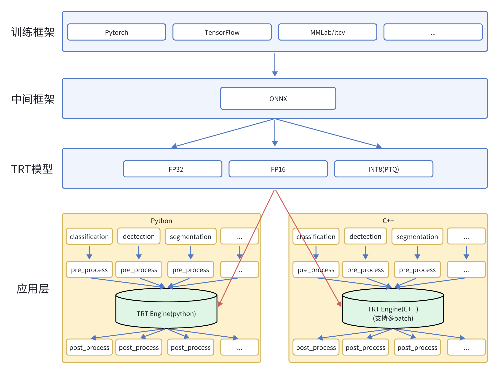

# trt_infer

该项目主要用于TensorRT的部署,包括TensorRT的推理引擎生成、推理引擎的加载、推理引擎的推理等功能。
里面提供了python和c++两种接口,C++的接口可以支持多batch的推理,python的接口暂时只支持单batch的推理。

## 环境搭建

直接使用官方的image，其中包含了所需要的torch、tensorrt、cuda等环境
```
docker pull nvcr.io/nvidia/pytorch:23.08-py3
```

## 架构



## 使用方法

### 1. 生成推理引擎

```
python onnx2trt.py -o input.onnx -e output.trt -p fp16
```

### 2. 运行推理引擎

python接口
```
python ./python/infer.py
```

c++接口
```
cd ./cpp && mkdir build && cd build
cmake ..
make
./main <trt_model_path> <image_folder_path>
```

## 补充说明
当前的架构还不太完善，后续需要进一步优化性能，补充新的模型，以及支持python多batch的推理。

